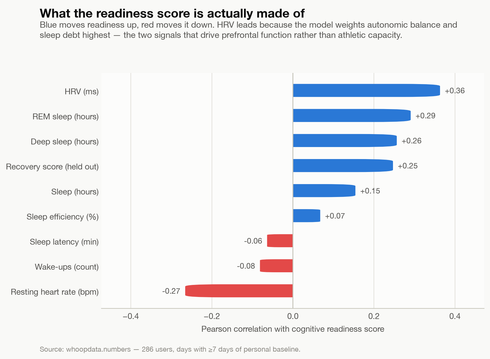
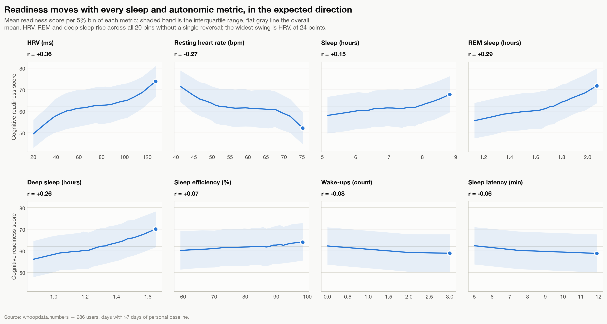

# WHOOP Coach × PubMed

Live demo: https://whoop-chatathon.vercel.app

This is our answer to the "WHOOP: A Healthier Future of Work" prompt. It's a hackathon project, not affiliated with WHOOP, and nothing in it is medical advice.

## The problem we picked

You get to the end of a work day completely fried and you have no idea why. Your WHOOP gives you a number. A chatbot will happily explain that number, but it won't tell you where it got its answer. So you guess, usually "it must be stress," and go fix the wrong thing.

We wanted a coach that figures out what's actually going on, tells you why, and shows you the research behind what it says.

## What's in the repo

- `whoop-app/` is the demo: a React recreation of the WHOOP app with a new Cognitive Readiness ring and a coach you can chat with.
- `backend/` is a separate Python project for the analysis side (more on that below).
- `whoop_coach_demo_script.md` is the conversation we're demoing and how the retrieval is supposed to work.
- `graph1.png` and `graph2.png` are the readiness score charts.

## Meet the member

Our demo member is USER_00152, a 49-year-old with a 9-to-5 corporate job and a side hustle at night. It's Friday, July 7. They just got off work and want to be wired for tonight.

Their app says cognitive readiness is 36% (low), sleep 67%, recovery 53%, and strain 10.9 on a rest day. The Daily Outlook reads "Depleted. Routine and administrative work only."

They figure it's work stress. The data disagrees. Stress peaked at 1.3, which is medium, and resting heart rate is 75.9 against a baseline of 74. What actually happened is a short night: 6h25 of sleep, and REM at 1h19, which is the biggest miss in their profile (z −1.79). Deep sleep is actually above baseline. That combination looks like a short night, not a hard day.

Here's what's pulling the readiness score down, in points (z-score in brackets):

- HRV deviation −9.6 (−1.33)
- REM sleep −7.8 (−1.79)
- Sleep debt −7.3 (−1.01)
- Resting heart rate −3.2 (−0.74)
- Deep sleep +3.3 (+1.13)
- Sleep continuity −0.9 (−0.32)

## How the coach is meant to work

1. It reads the member's numbers before they say anything.
2. It figures out which metric is really off. Here that's REM, not HRV, even though HRV carries more points.
3. It turns that into a physiology search, not the member's own words.
4. It searches PubMed twice. First for strong evidence (meta-analyses, systematic reviews, RCTs), then again with age and activity terms to adjust dose and timing.
5. It checks whether each study actually fits this person, and drops the ones that don't.
6. It answers with their numbers first, a line or two of research, a few actions sized to tonight, and a DOI on every claim.
7. Every recommendation gets logged as a Journal behavior, so WHOOP's Impacts engine can check it against their own data after 30 days.

The full three-turn conversation and the source table are in the demo script.

## Do the numbers hold up?

These two charts compare the readiness score against the metrics behind it, across 286 users. HRV, REM and deep sleep go up with readiness, and resting heart rate goes down.





## Running the app

You need Node 20.19+ (or 22.12+).

```bash
cd whoop-app
npm install
npm run dev
```

That serves it at http://localhost:5173. `npm run build` makes a production build and `npm run lint` runs the linter.

The screens are Home, Health, Community, More, Cognitive Readiness (tap the pink ring) and the coach (the W button in the nav). It's React 19, React Router 7 and Vite 8.

Vercel deploys from the repo root using `vercel.json`, which builds `whoop-app/` and rewrites every path to `index.html` so links like `/health` still work after a refresh.

## Where the data comes from

The member's numbers live in `whoop-app/src/data/persona.csv`. If you add more rows, the day switcher and the week chart fill in on their own.

The papers come from `whoop-app/src/data/evidence.json`, which we generate from the backend's hand-checked corpus with `python3 whoop-app/scripts/sync-evidence.py`.

The coach's Explain button opens those papers. Each one has a "what it supports" and a "what it does not support" section, and we show both equally.

## Rough edges you should know about

- The persona data is simulated. It describes the dataset, not a real person.
- The persona file has no stress data, so the stress line is modelled to fit the demo script. There's a `STRESS_PROFILE` switch in `src/persona.js` if you want a higher-stress day.
- The sleep score is 67, not the 100 in the CSV. That 100 doesn't match the same row's 6h25 of sleep, 78.1% efficiency and low REM, so we added a `sleep_score` column to override it. Without that column the app estimates it from efficiency and hours slept.
- The demo script says the HRV z-score is −1.53, but the persona file says −1.33. We went with the file.
- The chat coach in the app is rule-based. It answers from the persona and 7 curated papers. The live PubMed searching and the study-fit check are in the demo script and partly in `backend/`, but they aren't wired into the app yet.
- Some of the Health tab (WHOOP Age, blood pressure, ECG, the streak and battery) is placeholder content from a screen recording of the real app. The persona doesn't have fields for those.
- There's only one persona day, so the Strain & Recovery chart is a single dot on a week-long axis.
- Everything here is observational. The research is background from other people's studies, mostly athletes, and none of it covers desk workers. It's never proof about this member's own numbers.
- The breathing tip cites a paper on HRV biofeedback reducing stress, not raising HRV. The "do the hard task first" tip doesn't have a citation.

## What's built and what isn't

Built: the Cognitive Readiness ring and screen, the Stress and Strain & Recovery charts, the coach with Explain over 7 papers, and the backend (causal engine, readiness score, evidence layer, and a coach that checks its own numbers).

Still just a design: live two-pass PubMed retrieval in the app, the study-fit check that can reject a paper, the Journal and 30-day Impacts loop, and hooking the backend coach up to the app.

## The backend

`backend/` is its own Python project with a FastAPI service, a Streamlit dashboard, a CLI and 63 tests. Its README goes deep on the statistics, and `backend/docs/UI_BRIEF.md` describes how the app is supposed to talk to it.

```bash
cd backend
uv sync
uv run cnscoach validate
uv run pytest
```

The dataset it analyzes (`backend/data/raw/`) isn't committed, so the analysis commands and the dashboard need you to supply it. The coach needs `CNSCOACH_ANTHROPIC_API_KEY` in a `.env` file. Searching the evidence doesn't need anything.

## Layout

```
whoop-app/
  src/screens/       Home, Health, Community, More, Cognitive, Chat
  src/components/    rings, charts, nav, evidence cards, icons
  src/data/          persona.csv, evidence.json
  src/persona.js     reads the CSV, sleep score, modelled stress
  scripts/           sync-evidence.py
backend/             the Python analysis project
whoop_coach_demo_script.md
vercel.json
```

## Sources

Research comes from PubMed (NCBI), with DOI links to the original papers. PubMed and the authors keep all credit. The five papers in the demo script are Killgore 2010, Ludyga et al. 2016, Goessl et al. 2017, Hansen et al. 2018, and Sen & Tai 2023.
